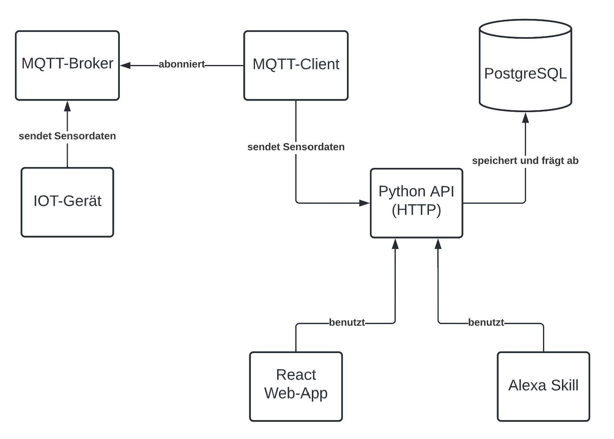
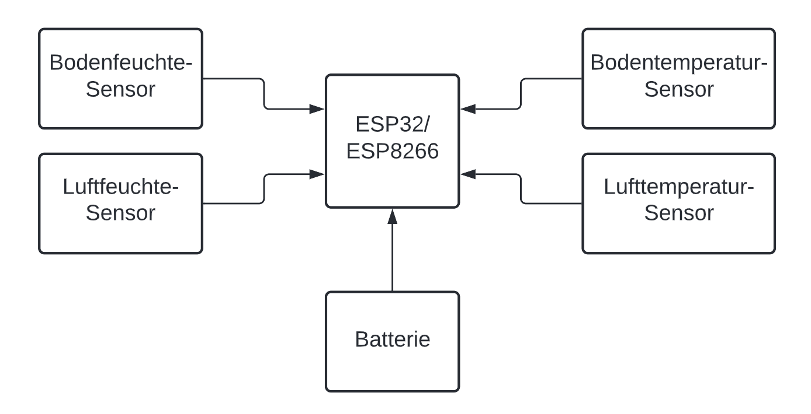
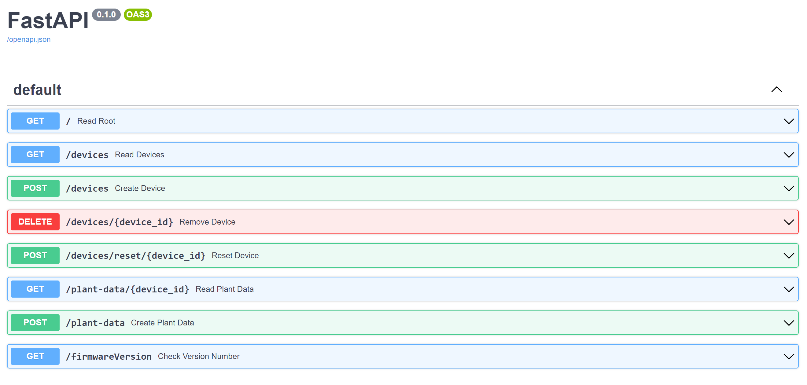
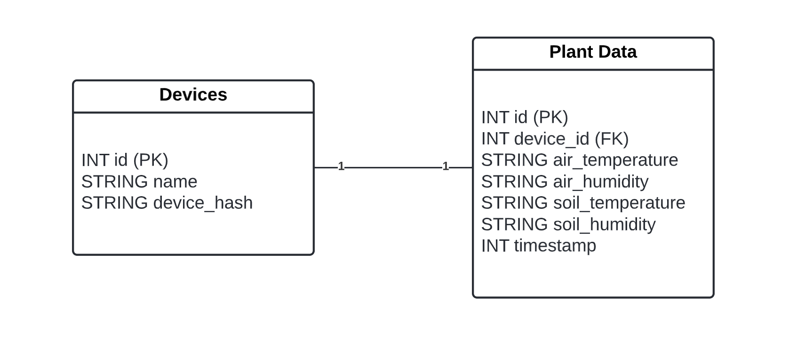
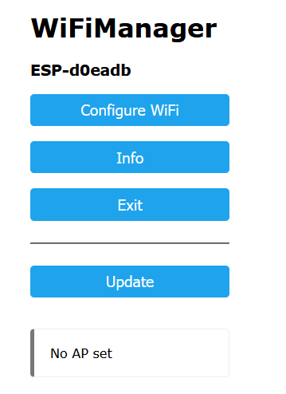
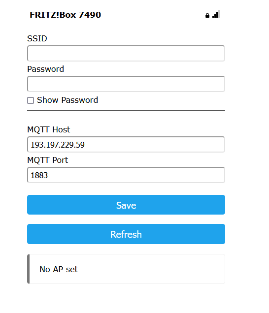
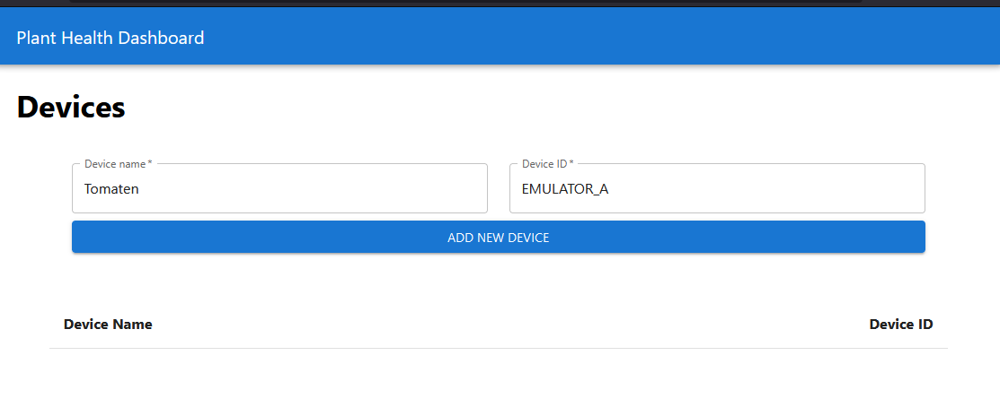
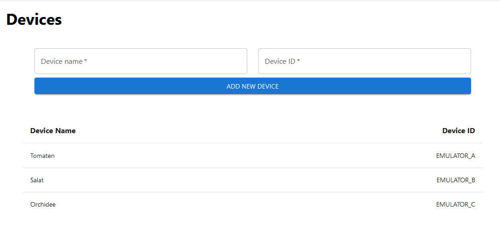
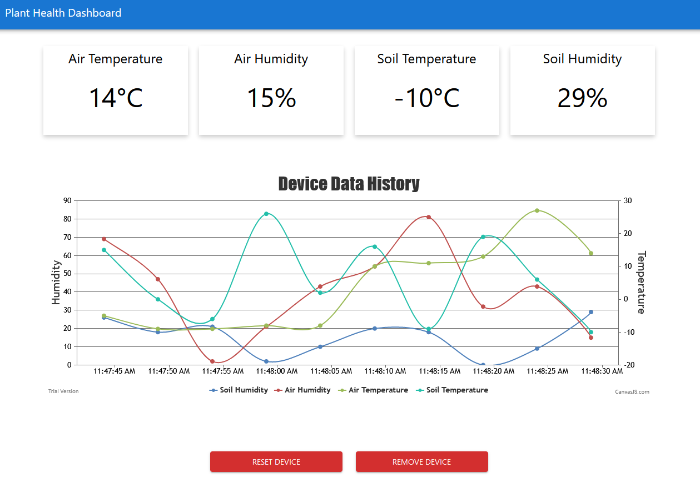
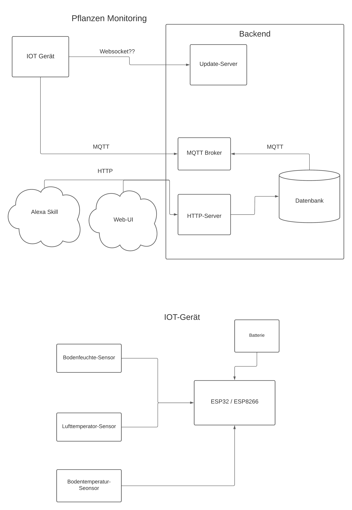

# Technische internetbasierte Systeme - Projekt zur Überwachung der Pflanzengesundheit
Axel Stark, 74399  
Sebastian Flum, 76855

## TODO:

1. Generelle Funktionsbeschreibung / Übersicht vom Projekt
2. Architektur erklären
3. Auf Komponenten eingehen
4. Benutzerhandbuch mit Bilder (swagger docs auch mit rein)
5. Getting started
  - Entwicklungsumgebung
  - Produktumgebung

- Bild zur Systemarchitektur überarbeiten (Fragezeichen entfernen, etc.)
- Beispielbild mit Mikrokontroller in Pflanze platziert
  


<br>

# Projektbeschreibung

Ziel dieses Projekts ist die Überwachung der Gesundheit von Pflanzen durch
ein technisches, internetbasiertes System.

Das hierbei entwickelte System ermöglicht es dem Nutzer, einen mit Sensoren
bestückten Mikrokontroller bei der Pflanze zu platzieren, welcher wichtige
Informationen zum Pflanzenstatus abfrägt. Folgende Daten werden von dem
Mikrokontroller gesammelt und in einem Web-Dashboard angezeigt:

- Bodentemperatur
- Bodenfeuchte
- Lufttemperatur
- Luftfeuchte

Durch die Registrierung des Geräts in einer Web-Applikation, kann der Nutzer
dabei die aktuellen Messwerte auslesen und historische Messwerte in einem
Liniendiagramm anzeigen lassen.

Neben dem Abfragen der Daten durch die Web-Applikation hat der Nutzer
außerdem die Möglichkeit, die oben genannten Daten durch einen Alexa-Skill
abzufragen, wodurch er beispielsweise schnell und einfach entscheiden kann,
ob die Pflanze gegossen werden muss und ob die Pflanze sich in ihrer optimalen
Wachstumsumgebung befindet.

<br>

# Systemarchitektur

Für die Umsetzung des Projekts wurde folgende Systemarchitektur entworfen:



## IOT-Gerät

Wie bereits erwähnt, ist das IOT-Gerät der bei der Pflanze anzubringende
Mikrokontroller bestehend aus einem ESP8266. Am
Mikrokontroller angebracht sind die zur Datensammlung benötigten Sensoren
für Bodenfeuchte und Bodentemperatur sowie Luftfeuchte und Lufttemperatur.
Der entwickelte Prototyp benötigt hierfür noch eine Spannungsversorgung 
mittels eines USB-Kabels. Für die Zuknunft wäre angedacht das System mittels 
einer Batterie zu betreiben, da es in der Nähe der meisten
Pflanzen keine Möglichkeit zur Spannungsversorgung per Steckdose gibt.

Der Mikrokontroller sammelt die im vorherigen
Kapitel beschriebenen Daten und sendet diese mithilfe des
MQTT-Netzwerkprotokolls an einen zugehörigen MQTT-Broker.
Dabei besitzt jedes Gerät eine eindeutige ID, beispielsweiße die Chip-ID des ESP8266. 
Diese wird dafür genutzt für jedes Gerät ein exclusives Topic zu erzeugen. 
Das Topic über welches die Daten gesendet werden, ist in der Form 
/\<Chip-ID>/plant_data.



### Reset

Um das Gerät auf die Werkseinstellungen zurück zu setzen, sendet man diesem
eine MQTT-Nachricht über das Topic /\<Chip-ID>/reset. 
Der Inhalt der übertragenen Nachricht ist dabei irrelevant, sie kann auch leer sein.
Es ist lediglich notwendig, dass das Gerät auf diesem Topic einen Nachricht erhält. 
Dann ist es dazu veranlasst, seine Konfiguration zu löschen. 

### Over-the-air Update (OTA)

Um Firmware-Updates möglichst komfortabel zu gestalten, werden diese über das Backend an die Geräte ausgliefert. 
Dazu fragt ein Gerät bei jedem Neustart die aktuelle Firmware-Version vom Server ab und vergleicht diese mit der Eigenen. Da Firmware-Versionen fortlaufend aufsteigend vergeben werden, ist der Vergleich sehr einfach. Ist die installierte Versionsnummer kleiner als die vom Server bereitgestellte lädt das Gerät die neue Firmware herunter und installiert diese. 

## MQTT-Broker

Der MQTT-Broker dient dem Datenaustausch zwischen dem IOT-Gerät und dem
Backend. Er empfängt veröffentlichte Nachrichten (Sensordaten), filtert die
Nachrichten nach dem Topic und verteilt sie an Clients, welche die
jeweiligen Topics abonniert haben.

## MQTT-Client

Ein in Python entwickelter MQTT-Client fragt die Python API nach den
registrierten Geräten ab und abonniert die zugehörigen Topics beim MQTT-Broker,
wodurch der Client die vom IOT-Gerät gesammelten Daten erhält. Diese Daten
werden kontinuierlich abgefragt und anschließend an die Python API
weitergegeben.

## Python API

Eine Python API stellt die Funktionalität zur Verarbeitung und Verteilung
aller wichtiger Daten dar. Sobald es die vom IOT-Gerät gesammelten Daten
erhält, legt es diese in einer PostgreSQL Datenbank zur späteren Verwendung
ab. Folgende Endpunkte werden von der API bereitgestellt:



### GET /

Root endpoint zum Testen des Servers.

### GET /devices

Fragt alle registrierten Geräte in der Datenbank ab.

### POST /devices

Registriert ein neues Gerät in der Datenbank.

### DELETE /devices/{device_id}

Löscht das IOT-Gerät mit der übergebenen Geräte-ID aus der Datenbank.

### POST /devices/reset/{device_id}

Setzt das IOT-Gerät mit der übergebenen Geräte-ID auf Werkszustand zurück.

### GET /plant-data/{device_id}

Fragt alle gesammelten Daten zu einem bestimmten IOT-Gerät ab.

### POST /plant-data

Legt einen neuen Datensatz über die gesammelten Sensordaten in der Datenbank an.

### GET /firmwareVersion

Fragt die aktuelle Firmware-Version des IOT-Geräts ab.

## PostgreSQL Datenbank

Die PostgreSQL Datenbank dient zur Speicherung und Abfrage der erfassten
Sensordaten. Dafür wurde folgendes Datenbankmodell entworfen:



## React Web Applikation

Eine in React entwickelte Web-Applikation ermöglicht die Registrierung und
Löschung von IOT-Geräten sowie das Anzeigen der zugehörigen Daten. Um diese
Funktionalität bieten zu können, benutzt die Web-App die von der Python API
bereitgestellten Endpunkte.

## Alexa Skill

Der Alexa Skill dient der schnellen Interaktion mit dem System. 
Mittels der Komandos "Wie geht es meinen Pflanzen" oder auf simple weiße mit 
dem Wort "Status" kann mit dem Skill interagiert werden. 
Dieser fragt im Hintergrund ab, welche Pflanzen im System registriert sind und 
ruft den letzten Datensatz im Backend ab. 
Um die Interaktionen kurz zu halten, werden die Informationen auf das wichtigste
Kriterium, die Bodenfeuchte, reduziert. 
Liegt diese bei einer Pflanze unter 30 %, gibt Alexa den Hinweis darauf, dass diese
Wasser benötigt. 
Sind alle Werte der Bodenfeuchte >30 %, meldet der Skill, dass es allen Pflanzen gut geht.  


<br>

# Installation und Ausführung

## Requirements
- [Docker & Docker-Compose]
- [Node.js]
- [Python]
- [Mosquitto]

[Docker & Docker-Compose]: https://www.docker.com/
[Node.js]: https://nodejs.org/en/
[Python]: https://www.python.org/
[Mosquitto]: https://mosquitto.org/

## Startup
### Backend
Im Root-Ordner des Projekts folgenden Befehl ausführen 
```console
<project-folder>$ docker-compose up 
```

### Frontend
Im Ordner **web** das Shell-Skript **start.sh** ausführen. 
``` console
<project-folder>/web$ ./start.sh
```


<br>

# Nutzerhandbuch

## Konfiguration des IOT-Geräts

Für die Nutzung des Geräts ist eine WLAN-Verbindung notwendig. Um diese einzurichten öffnet das Gerät zunächst einen eigenen WiFi-Access-Point. 
Über diesen kann man sich mittels eines PCs oder Smartphones verbinden und auf die Konfigurationsseite gelangen.   
Das Standartpasswort ist: 0123456789  
Dort findet sich unter anderem auch die Geräte-ID wieder. 
Unter dem Punkt **Configure WiFi** findet sich die Möglichkeit dem Gerät die Login-Daten zu einem WiFi-AP zu übermittel. 



Dort findet sich eine Liste der erkannten WiFi-APs wieder. 
Über ein Formular kann die gewünschte SSID und das zugehörige Passwort eingegeben werden. 
Zusätzlich kann dort der zu verwendende MQTT-Broker spezifiziert werden. 
Nachdem die Konfiguration gespeichert wurde, versucht sich das Gerät mit dem angegebenen AP zu verbinden. 
Sollte dies scheitern, hält das Gerät seinen eigenen AP offen, um die Konfiguration fortzusetzen. 



## Hinzufügen eines Geräts in der Web-Applikation

Um ein neues Gerät hinzuzufügen, muss ein Name für das Gerät angegeben werden. 
Dieser kann frei gewählt werden und wird auch vom Alexa Skill verwendent. 
Der andere anzugebende Parameter ist die Device-ID. Diese dient dazu ein Gerät eindeutig zu 
identifizieren und die Daten, welche das Gerät sendet zuzuordnen. 


<br> 

## Geräteliste

Unterhalb des Formulars zum hinzufügen von neuen Gerätes werden die bestehenden Geräte gelistet. 
Hier finden sich auch die beiden Angaben *Device Name* und *Device ID* wieder. 
Klickt man auf eines dieser Listen-Items wird man auf die Detailansicht weitergeleitet.



<br> 

## Detailansicht eines IOT-Geräts

Die Detailansicht dient dazu die vom jeweiligen Gerät gesendeten Daten darzustellen. 
Zum einen in Form von Kacheln werden die zuletzt gesendeten Daten angezeigt.
Unterhalb dessen werden die Daten in einem Historischen Verlauf angezeigt. 
Derzeit, werden hier die lezten 10 vom Gerät gesendeten Daten als Line-Chart visualisiert. 
Die in der Grafik dargestellten Daten wirken chaotisch, da sie durch einen Emulator erzeugt wurden, welcher zufällige Daten erzeugt. 

In der Detailansicht finden sich zudem zwei Buttons, um zum einen das Gerät zurückzusetzten und zum anderen das Gerät gänzlich aus dem System zu entfernen. Dabei werden zudem alle von dem Gerät gesendeten Daten aus der Datenbank gelöscht. 



# OLD STUFF


## Getting started

### Building the app
```shell
docker compose -f docker-compose.dev.yaml build  # dev
docker compose build  # prod
```

### Starting the app
```shell
docker compose -f docker-compose.dev.yaml up  # dev
docker compose up  # prod
```

### Backend
- Add device table to db:
  - Attributes: Name, Device ID und irgend einen primary key für Mapping mit
    den Daten
  - Endpoint für Hinzufügen von neuem Gerät

### Frontend
- Drawer mit 2 Drawern die einen zu den folgenden Seiten führen:
  - Geräteübersicht wo man Geräte hinzufügen und auswählen kann (Startseite)
  - Dashboard eines Geräts wo man die jeweiligen Daten sieht

### Alexa
- Find out how development works

### Docker compose
- create docker compose for prod and mostly since we need to set different environment variables in prod
  (backend url, database connection, etc...)


## Pflanzen Überwachung

### Alexa

- Errinerung zum  gießen
  - Statusleuchte von Alexa
- Gesundheitsstatus abfragen
  - Bodenfeuchte
  - Bodentemperatur
  - Lufttemperatur

### Web-UI

- Daten anzeigen im zeitlichen verlauf (Dashboard)
- Aktuelle Werte Anzeigen
- Gießhistorie

### IOT-Gerät

- Gießen registrieren (Wenn Bodenfeuchte schnell steigt)
- Werte erfassen (15 min Takt)
  - Lufttemp.
  - Bodentemp.
  - Bodenfeuchte
- MQTT an DB versenden
- OTA-Update
  - Wöchentlich/Täglich fragen ob neue Firmware version vorhanden, gegebenenfalls updaten
- WIFI-Config
  - Hotspot aufmachen -> mit Hotspot verbinden -> WIFI-Cridentials eingeben

### Datenbank

- SQL

### HTTP-Server

- Python
  - FAST-API
  - SQL-Alchemy

### MQTT Broker

- Self-Hosted oder Bantel-Server

### Update-Server

- evtl. einfacher File-Server

### Backend allgemein

- Microservices in Docker-Containern

## Architektur


https://www.dlr.rlp.de/Internet/global/themen.nsf/b81d6f06b181d7e7c1256e920051ac19/6449e62b480fcb10c1257d5f0034e7b5?OpenDocument


## MQTT 
User: plantData
Pass: plantdatatibs